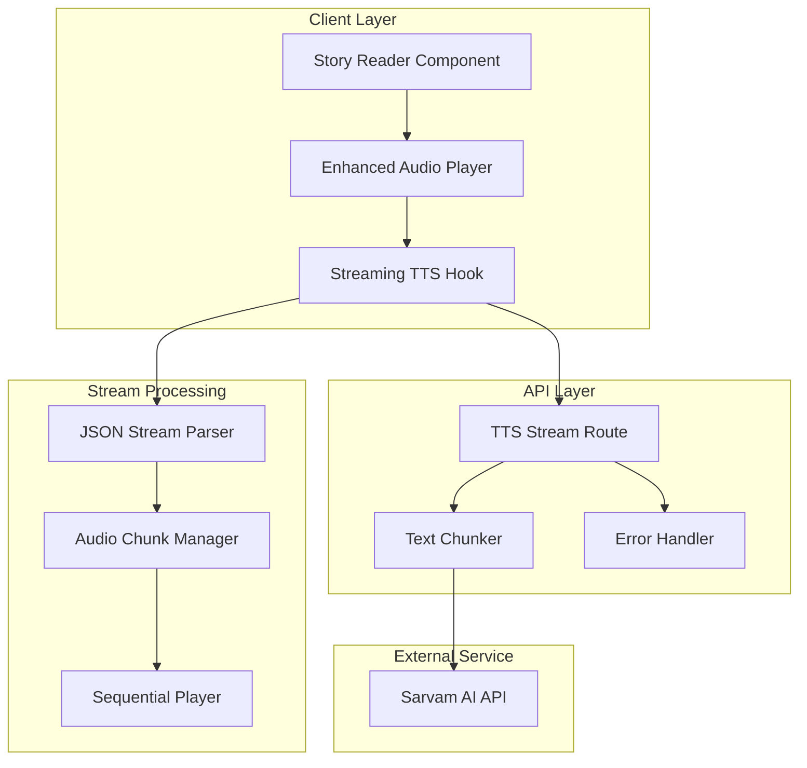

# Design Document

## Overview

This design addresses critical audio streaming issues in the story platform's TTS functionality. The current implementation suffers from JSON parsing errors, incomplete audio processing, and poor streaming performance. The solution involves implementing robust JSON streaming, proper audio chunk concatenation, intelligent text splitting, and enhanced error handling.

## Architecture

### Current Issues Analysis

Based on the error logs and code review, the main problems are:

1. **JSON Parsing Errors**: "Unterminated string in JSON at position 15120" indicates the streaming JSON parser is receiving incomplete JSON chunks
2. **Audio Chunk Processing**: Only using the first audio chunk when multiple chunks are returned from the API
3. **Text Chunking**: Poor text splitting strategy causing content to be skipped
4. **Stream Handling**: Inadequate buffering and error recovery in the streaming implementation

### Enhanced System Architecture



## Components and Interfaces

### 1. Enhanced JSON Stream Parser

The current implementation has issues with partial JSON parsing. We need a robust streaming JSON parser that can handle incomplete chunks.

```typescript
interface StreamParser {
  parseChunk(chunk: string): ParsedData[];
  getBuffer(): string;
  reset(): void;
}

interface ParsedData {
  type: 'audio_chunk' | 'audio_chunk_part' | 'complete' | 'error';
  data?: string;
  index?: number;
  total?: number;
  part?: number;
  totalParts?: number;
  isLastPart?: boolean;
  message?: string;
}

class RobustStreamParser implements StreamParser {
  private buffer: string = '';
  
  parseChunk(chunk: string): ParsedData[] {
    this.buffer += chunk;
    const results: ParsedData[] = [];
    const lines = this.buffer.split('\n');
    
    // Keep the last line in buffer if it doesn't end with newline
    this.buffer = this.buffer.endsWith('\n') ? '' : lines.pop() || '';
    
    for (const line of lines) {
      if (line.startsWith('data: ')) {
        try {
          const jsonStr = line.slice(6);
          if (jsonStr.trim()) {
            const data = JSON.parse(jsonStr);
            results.push(data);
          }
        } catch (error) {
          console.warn('[STREAM_PARSER] Failed to parse line:', line.substring(0, 100));
          // Continue processing other lines instead of failing completely
        }
      }
    }
    
    return results;
  }
}
```

### 2. Audio Chunk Manager

The current implementation only uses the first audio chunk. We need proper audio concatenation for WAV files.

```typescript
interface AudioChunkManager {
  addChunk(audioData: ArrayBuffer, index: number): void;
  combineChunks(): ArrayBuffer;
  getProgress(): number;
  reset(): void;
}

class WAVAudioChunkManager implements AudioChunkManager {
  private chunks: Map<number, ArrayBuffer> = new Map();
  private totalChunks: number = 0;
  
  addChunk(audioData: ArrayBuffer, index: number): void {
    this.chunks.set(index, audioData);
  }
  
  combineChunks(): ArrayBuffer {
    if (this.chunks.size === 0) return new ArrayBuffer(0);
    if (this.chunks.size === 1) return this.chunks.values().next().value;
    
    // Proper WAV file concatenation
    return this.concatenateWAVFiles(Array.from(this.chunks.values()));
  }
  
  private concatenateWAVFiles(buffers: ArrayBuffer[]): ArrayBuffer {
    // Extract audio data from each WAV file (skip headers)
    const audioDataChunks: Uint8Array[] = [];
    let totalAudioSize = 0;
    let sampleRate = 22050;
    let channels = 1;
    let bitsPerSample = 16;
    
    for (const buffer of buffers) {
      const view = new DataView(buffer);
      
      // Parse WAV header to get audio parameters
      if (buffer.byteLength >= 44) {
        sampleRate = view.getUint32(24, true);
        channels = view.getUint16(22, true);
        bitsPerSample = view.getUint16(34, true);
        
        // Find data chunk
        let dataOffset = 44;
        const dataSize = view.getUint32(40, true);
        
        // Extract audio data (skip WAV header)
        const audioData = new Uint8Array(buffer, dataOffset, dataSize);
        audioDataChunks.push(audioData);
        totalAudioSize += audioData.length;
      }
    }
    
    // Create new WAV file with combined audio data
    return this.createWAVFile(audioDataChunks, totalAudioSize, sampleRate, channels, bitsPerSample);
  }
  
  private createWAVFile(
    audioChunks: Uint8Array[],
    totalAudioSize: number,
    sampleRate: number,
    channels: number,
    bitsPerSample: number
  ): ArrayBuffer {
    const buffer = new ArrayBuffer(44 + totalAudioSize);
    const view = new DataView(buffer);
    
    // WAV header
    const writeString = (offset: number, string: string) => {
      for (let i = 0; i < string.length; i++) {
        view.setUint8(offset + i, string.charCodeAt(i));
      }
    };
    
    writeString(0, 'RIFF');
    view.setUint32(4, 36 + totalAudioSize, true);
    writeString(8, 'WAVE');
    writeString(12, 'fmt ');
    view.setUint32(16, 16, true);
    view.setUint16(20, 1, true);
    view.setUint16(22, channels, true);
    view.setUint32(24, sampleRate, true);
    view.setUint32(28, sampleRate * channels * bitsPerSample / 8, true);
    view.setUint16(32, channels * bitsPerSample / 8, true);
    view.setUint16(34, bitsPerSample, true);
    writeString(36, 'data');
    view.setUint32(40, totalAudioSize, true);
    
    // Copy audio data
    const audioView = new Uint8Array(buffer, 44);
    let offset = 0;
    for (const chunk of audioChunks) {
      audioView.set(chunk, offset);
      offset += chunk.length;
    }
    
    return buffer;
  }
}
```

### 3. Enhanced Text Chunking Strategy

The current text splitting needs improvement to avoid skipping content and ensure natural speech breaks.

```typescript
interface TextChunker {
  splitText(text: string, maxChunkSize: number): TextChunk[];
  validateChunks(chunks: TextChunk[], originalText: string): boolean;
}

interface TextChunk {
  text: string;
  index: number;
  startPosition: number;
  endPosition: number;
}

class IntelligentTextChunker implements TextChunker {
  splitText(text: string, maxChunkSize: number = 500): TextChunk[] {
    const chunks: TextChunk[] = [];
    let currentPosition = 0;
    
    // First, try to split by paragraphs
    const paragraphs = text.split(/\n\s*\n/).filter(p => p.trim().length > 0);
    
    for (const paragraph of paragraphs) {
      if (paragraph.length <= maxChunkSize) {
        chunks.push({
          text: paragraph.trim(),
          index: chunks.length,
          startPosition: currentPosition,
          endPosition: currentPosition + paragraph.length
        });
        currentPosition += paragraph.length;
      } else {
        // Split long paragraphs by sentences
        const sentenceChunks = this.splitBySentences(paragraph, maxChunkSize, currentPosition);
        chunks.push(...sentenceChunks);
        currentPosition += paragraph.length;
      }
    }
    
    // Validate that we haven't lost any content
    if (!this.validateChunks(chunks, text)) {
      console.warn('[TEXT_CHUNKER] Validation failed, falling back to simple splitting');
      return this.fallbackSplit(text, maxChunkSize);
    }
    
    return chunks;
  }
  
  private splitBySentences(text: string, maxChunkSize: number, startPos: number): TextChunk[] {
    const chunks: TextChunk[] = [];
    const sentences = text.split(/(?<=[.!?])\s+/).filter(s => s.trim().length > 0);
    
    let currentChunk = '';
    let chunkStartPos = startPos;
    
    for (const sentence of sentences) {
      if (currentChunk.length + sentence.length > maxChunkSize && currentChunk.length > 0) {
        chunks.push({
          text: currentChunk.trim(),
          index: chunks.length,
          startPosition: chunkStartPos,
          endPosition: chunkStartPos + currentChunk.length
        });
        
        chunkStartPos += currentChunk.length;
        currentChunk = sentence;
      } else {
        currentChunk += (currentChunk ? ' ' : '') + sentence;
      }
    }
    
    if (currentChunk.trim()) {
      chunks.push({
        text: currentChunk.trim(),
        index: chunks.length,
        startPosition: chunkStartPos,
        endPosition: chunkStartPos + currentChunk.length
      });
    }
    
    return chunks;
  }
  
  validateChunks(chunks: TextChunk[], originalText: string): boolean {
    const reconstructed = chunks.map(c => c.text).join(' ');
    const originalWords = originalText.replace(/\s+/g, ' ').trim().split(' ');
    const reconstructedWords = reconstructed.replace(/\s+/g, ' ').trim().split(' ');
    
    // Allow for minor differences due to whitespace normalization
    const similarity = this.calculateSimilarity(originalWords, reconstructedWords);
    return similarity > 0.95; // 95% similarity threshold
  }
  
  private calculateSimilarity(arr1: string[], arr2: string[]): number {
    const set1 = new Set(arr1);
    const set2 = new Set(arr2);
    const intersection = new Set([...set1].filter(x => set2.has(x)));
    const union = new Set([...set1, ...set2]);
    return intersection.size / union.size;
  }
  
  private fallbackSplit(text: string, maxChunkSize: number): TextChunk[] {
    const chunks: TextChunk[] = [];
    for (let i = 0; i < text.length; i += maxChunkSize) {
      chunks.push({
        text: text.slice(i, i + maxChunkSize),
        index: chunks.length,
        startPosition: i,
        endPosition: Math.min(i + maxChunkSize, text.length)
      });
    }
    return chunks;
  }
}
```

### 4. Sequential Audio Player

A robust audio player that handles multiple chunks seamlessly.

```typescript
interface SequentialAudioPlayer {
  loadChunks(chunks: ArrayBuffer[]): Promise<void>;
  play(): Promise<void>;
  pause(): void;
  stop(): void;
  seekTo(position: number): void;
  getCurrentTime(): number;
  getDuration(): number;
  onProgress(callback: (progress: number) => void): void;
  onComplete(callback: () => void): void;
}

class WebAudioSequentialPlayer implements SequentialAudioPlayer {
  private audioContext: AudioContext;
  private audioBuffers: AudioBuffer[] = [];
  private currentChunkIndex: number = 0;
  private currentSource: AudioBufferSourceNode | null = null;
  private startTime: number = 0;
  private pauseTime: number = 0;
  private isPlaying: boolean = false;
  private progressCallback?: (progress: number) => void;
  private completeCallback?: () => void;
  
  constructor() {
    this.audioContext = new (window.AudioContext || (window as any).webkitAudioContext)();
  }
  
  async loadChunks(chunks: ArrayBuffer[]): Promise<void> {
    this.audioBuffers = [];
    
    for (const chunk of chunks) {
      try {
        const audioBuffer = await this.audioContext.decodeAudioData(chunk.slice(0));
        this.audioBuffers.push(audioBuffer);
      } catch (error) {
        console.error('[AUDIO_PLAYER] Failed to decode audio chunk:', error);
        throw new Error('Failed to decode audio data');
      }
    }
  }
  
  async play(): Promise<void> {
    if (this.audioBuffers.length === 0) {
      throw new Error('No audio chunks loaded');
    }
    
    if (this.audioContext.state === 'suspended') {
      await this.audioContext.resume();
    }
    
    this.isPlaying = true;
    this.startTime = this.audioContext.currentTime - this.pauseTime;
    
    await this.playChunk(this.currentChunkIndex);
  }
  
  private async playChunk(index: number): Promise<void> {
    if (index >= this.audioBuffers.length || !this.isPlaying) {
      this.onPlaybackComplete();
      return;
    }
    
    const buffer = this.audioBuffers[index];
    const source = this.audioContext.createBufferSource();
    source.buffer = buffer;
    source.connect(this.audioContext.destination);
    
    this.currentSource = source;
    this.currentChunkIndex = index;
    
    source.onended = () => {
      if (this.isPlaying) {
        this.playChunk(index + 1);
      }
    };
    
    source.start();
    
    // Update progress
    this.updateProgress();
  }
  
  private updateProgress(): void {
    if (!this.isPlaying || !this.progressCallback) return;
    
    const totalDuration = this.getDuration();
    const currentTime = this.getCurrentTime();
    const progress = totalDuration > 0 ? (currentTime / totalDuration) * 100 : 0;
    
    this.progressCallback(progress);
    
    if (this.isPlaying) {
      requestAnimationFrame(() => this.updateProgress());
    }
  }
  
  pause(): void {
    this.isPlaying = false;
    this.pauseTime = this.audioContext.currentTime - this.startTime;
    
    if (this.currentSource) {
      this.currentSource.stop();
      this.currentSource = null;
    }
  }
  
  stop(): void {
    this.isPlaying = false;
    this.pauseTime = 0;
    this.currentChunkIndex = 0;
    
    if (this.currentSource) {
      this.currentSource.stop();
      this.currentSource = null;
    }
  }
  
  getDuration(): number {
    return this.audioBuffers.reduce((total, buffer) => total + buffer.duration, 0);
  }
  
  getCurrentTime(): number {
    if (!this.isPlaying) return this.pauseTime;
    
    let elapsed = 0;
    for (let i = 0; i < this.currentChunkIndex; i++) {
      elapsed += this.audioBuffers[i].duration;
    }
    
    return elapsed + (this.audioContext.currentTime - this.startTime);
  }
  
  private onPlaybackComplete(): void {
    this.isPlaying = false;
    this.pauseTime = 0;
    this.currentChunkIndex = 0;
    
    if (this.completeCallback) {
      this.completeCallback();
    }
  }
  
  onProgress(callback: (progress: number) => void): void {
    this.progressCallback = callback;
  }
  
  onComplete(callback: () => void): void {
    this.completeCallback = callback;
  }
}
```

## Data Models

### Enhanced Streaming State

```typescript
interface StreamingTTSState {
  isLoading: boolean;
  isStreaming: boolean;
  isPlaying: boolean;
  progress: number;
  currentChunk: number;
  totalChunks: number;
  error: string | null;
  audioChunks: ArrayBuffer[];
  combinedAudio: ArrayBuffer | null;
  duration: number;
  currentTime: number;
}

interface StreamingOptions {
  text: string;
  language: string;
  speaker?: string;
  pitch?: number;
  pace?: number;
  chunkSize?: number;
  retryAttempts?: number;
}
```

## Error Handling

### Comprehensive Error Recovery

```typescript
interface ErrorRecoveryStrategy {
  type: 'retry' | 'skip' | 'fallback' | 'abort';
  maxAttempts: number;
  backoffMs: number;
  fallbackAction?: () => Promise<void>;
}

class StreamingErrorHandler {
  private retryAttempts: Map<string, number> = new Map();
  
  async handleError(error: Error, context: string, strategy: ErrorRecoveryStrategy): Promise<boolean> {
    const attempts = this.retryAttempts.get(context) || 0;
    
    switch (strategy.type) {
      case 'retry':
        if (attempts < strategy.maxAttempts) {
          this.retryAttempts.set(context, attempts + 1);
          await this.delay(strategy.backoffMs * Math.pow(2, attempts));
          return true; // Retry
        }
        break;
        
      case 'skip':
        console.warn(`[ERROR_HANDLER] Skipping failed operation: ${context}`);
        return false; // Don't retry, continue with next
        
      case 'fallback':
        if (strategy.fallbackAction) {
          await strategy.fallbackAction();
        }
        return false;
        
      case 'abort':
        throw error;
    }
    
    return false;
  }
  
  private delay(ms: number): Promise<void> {
    return new Promise(resolve => setTimeout(resolve, ms));
  }
  
  reset(context?: string): void {
    if (context) {
      this.retryAttempts.delete(context);
    } else {
      this.retryAttempts.clear();
    }
  }
}
```

## Testing Strategy

### Unit Testing

```typescript
// Test cases for critical components
describe('RobustStreamParser', () => {
  it('should handle incomplete JSON chunks', () => {
    const parser = new RobustStreamParser();
    const chunk1 = 'data: {"type":"audio_chunk","data":"abc';
    const chunk2 = 'def","index":0}\n';
    
    const results1 = parser.parseChunk(chunk1);
    expect(results1).toHaveLength(0);
    
    const results2 = parser.parseChunk(chunk2);
    expect(results2).toHaveLength(1);
    expect(results2[0].data).toBe('abcdef');
  });
});

describe('WAVAudioChunkManager', () => {
  it('should properly concatenate WAV files', async () => {
    const manager = new WAVAudioChunkManager();
    // Add test WAV chunks
    // Verify combined output is valid WAV
  });
});

describe('IntelligentTextChunker', () => {
  it('should not lose content when chunking', () => {
    const chunker = new IntelligentTextChunker();
    const text = "This is a test. It has multiple sentences. Some are longer than others.";
    const chunks = chunker.splitText(text, 30);
    
    expect(chunker.validateChunks(chunks, text)).toBe(true);
  });
});
```

### Integration Testing

```typescript
describe('Audio Streaming Integration', () => {
  it('should handle complete streaming workflow', async () => {
    // Mock Sarvam API responses
    // Test complete flow from text to audio playback
    // Verify no content is lost
    // Verify audio plays continuously
  });
});
```

## Performance Optimization

### Streaming Performance

1. **Parallel Processing**: Process multiple text chunks simultaneously while maintaining playback order
2. **Progressive Loading**: Start playback of first chunk while processing remaining chunks
3. **Intelligent Caching**: Cache audio chunks to avoid regeneration
4. **Memory Management**: Properly dispose of audio buffers after playback

### Network Optimization

1. **Connection Pooling**: Reuse HTTP connections for multiple API calls
2. **Compression**: Use gzip compression for API responses
3. **Retry Logic**: Implement exponential backoff for failed requests
4. **Timeout Handling**: Set appropriate timeouts for different operations

## Translation Quality Assurance

### Enhanced Translation Strategy

The system implements a multi-layered approach to ensure accurate, complete translations:

```typescript
interface TranslationQualityCheck {
  originalLength: number;
  translatedLength: number;
  lengthRatio: number;
  originalWords: number;
  translatedWords: number;
  wordRatio: number;
  isValid: boolean;
}

class TranslationQualityValidator {
  validateTranslation(original: string, translated: string): TranslationQualityCheck {
    const originalLength = original.length;
    const translatedLength = translated.length;
    const lengthRatio = translatedLength / originalLength;
    
    const originalWords = original.split(/\s+/).length;
    const translatedWords = translated.split(/\s+/).length;
    const wordRatio = translatedWords / originalWords;
    
    // Translation is considered invalid if it's suspiciously short
    const isValid = lengthRatio >= 0.3 && wordRatio >= 0.2;
    
    return {
      originalLength,
      translatedLength,
      lengthRatio,
      originalWords,
      translatedWords,
      wordRatio,
      isValid
    };
  }
}
```

### Translation Prompt Engineering

The system uses carefully crafted prompts to prevent summarization:

```typescript
const createTranslationPrompt = (text: string, targetLanguage: string): string => {
  return `You are a professional translator. Translate the following English text to ${targetLanguage} with these requirements:

1. Translate EVERY sentence and paragraph exactly as written
2. Do NOT summarize, shorten, or skip any content
3. Maintain the exact same structure, length, and narrative flow
4. Preserve all dialogue, descriptions, and story elements
5. Keep the same paragraph breaks and formatting
6. Return ONLY the complete translated text, nothing else

Text to translate:

${text}`;
};
```

### Fallback Translation Strategy

When full-text translation fails or produces suspicious results, the system implements chunk-by-chunk translation:

```typescript
async function translateInChunks(
  text: string,
  targetLanguage: string,
  genAI: GoogleGenerativeAI,
  requestId: string
): Promise<string | null> {
  const chunks = text.split(/\n\s*\n/).filter(chunk => chunk.trim().length > 0);
  const translatedChunks: string[] = [];
  
  for (const chunk of chunks) {
    const chunkPrompt = `Translate this ${targetLanguage} text exactly as written. Do not summarize or change the content:

${chunk}`;
    
    try {
      const result = await genAI.getGenerativeModel({ model: "gemini-2.0-flash" })
        .generateContent(chunkPrompt);
      translatedChunks.push(result.response.text().trim());
    } catch (error) {
      // Use original chunk if translation fails
      translatedChunks.push(chunk);
    }
  }
  
  return translatedChunks.join('\n\n');
}
```

## Security Considerations

### Data Protection

1. **API Key Security**: Ensure Sarvam API keys are properly secured
2. **Content Validation**: Validate and sanitize text input before processing
3. **Rate Limiting**: Implement client-side rate limiting to prevent abuse
4. **Error Information**: Avoid exposing sensitive information in error messages

### Audio Security

1. **Content Filtering**: Implement content filtering for inappropriate text
2. **Audio Validation**: Validate audio data before playback
3. **Memory Safety**: Prevent memory leaks from audio buffers
4. **Cross-Origin**: Properly handle CORS for audio streaming

### Translation Security

1. **Content Preservation**: Ensure translations maintain original content integrity
2. **Quality Validation**: Implement automated checks for translation quality
3. **Fallback Mechanisms**: Provide robust fallback strategies for translation failures
4. **Logging and Monitoring**: Track translation quality metrics for continuous improvement