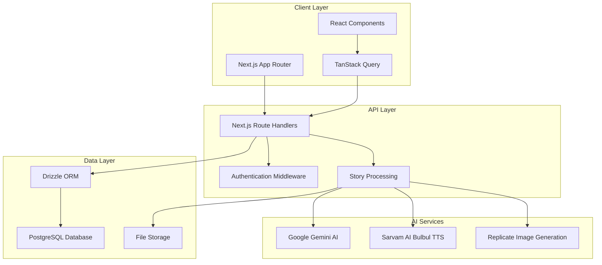
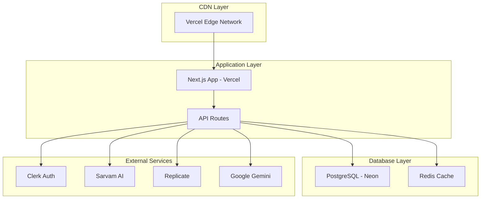

# Design Document

## Overview

The enhanced story platform builds upon the existing Next.js application to create a comprehensive story writing and storytelling ecosystem. The design maintains the current architecture while adding new story creation modes, publication workflows, multi-language text-to-speech capabilities, and enhanced administrative features.

The platform will support two distinct user journeys:
1. **Structured Life Stories**: The existing 7-stage wizard for therapeutic storytelling
2. **Creative Blog Stories**: A new rich-text editor for creative writing with AI assistance

## Architecture

### High-Level System Architecture



### Enhanced Database Schema

The existing schema will be extended with new tables and fields:

```sql
-- New story types enum
ALTER TYPE story_status ADD VALUE 'pending_review';
ALTER TYPE story_status ADD VALUE 'published';
ALTER TYPE story_status ADD VALUE 'rejected';

-- New story type field
ALTER TABLE stories ADD COLUMN story_type VARCHAR(20) DEFAULT 'life_story';
-- Values: 'life_story', 'blog_story'

-- New content field for blog stories
ALTER TABLE stories ADD COLUMN content TEXT;

-- New publication fields
ALTER TABLE stories ADD COLUMN banner_image_url TEXT;
ALTER TABLE stories ADD COLUMN thumbnail_image_url TEXT;
ALTER TABLE stories ADD COLUMN published_at TIMESTAMP;
ALTER TABLE stories ADD COLUMN view_count INTEGER DEFAULT 0;
ALTER TABLE stories ADD COLUMN listen_count INTEGER DEFAULT 0;

-- New table for story analytics
CREATE TABLE story_analytics (
    id UUID PRIMARY KEY DEFAULT gen_random_uuid(),
    story_id UUID NOT NULL REFERENCES stories(id) ON DELETE CASCADE,
    event_type VARCHAR(20) NOT NULL, -- 'view', 'listen', 'share'
    language_code VARCHAR(10), -- for TTS events
    created_at TIMESTAMP DEFAULT NOW()
);

-- Enhanced appointments table
ALTER TABLE appointments ADD COLUMN appointment_date TIMESTAMP;
ALTER TABLE appointments ADD COLUMN notes TEXT;
ALTER TABLE appointments ADD COLUMN psychiatrist_feedback TEXT;
```

## Components and Interfaces

### 1. Story Creation Interface

#### Story Type Selection Component
```typescript
interface StoryTypeSelectionProps {
  onSelect: (type: 'life_story' | 'blog_story') => void;
}
```

**Features:**
- Two prominent cards for story type selection
- Visual icons and descriptions for each type
- Loading states during navigation
- Responsive design for mobile devices

#### Enhanced Blog Editor Component
```typescript
interface BlogEditorProps {
  storyId: string;
  initialContent?: string;
  onSave: (content: string) => Promise<void>;
  onAIAssist: (selectedText: string) => Promise<string>;
}
```

**Features:**
- Rich text editing with TipTap
- AI content generation and improvement
- Auto-save functionality
- Image upload and embedding
- Real-time word count and reading time estimation

### 2. Story Submission Interface

#### Publication Workflow Component
```typescript
interface PublicationWorkflowProps {
  storyId: string;
  storyContent: string;
  onPublish: (data: PublicationData) => Promise<void>;
}

interface PublicationData {
  bannerImageUrl: string;
  thumbnailImageUrl: string;
  visibility: 'private' | 'public';
  title: string;
  description?: string;
}
```

**Features:**
- AI-generated banner and thumbnail options
- Image regeneration capabilities
- Publication settings (public/private)
- Preview of how the story will appear
- Loading states for image generation

### 3. Public Story Discovery

#### Story Grid Component
```typescript
interface StoryGridProps {
  stories: PublicStory[];
  onStoryClick: (storyId: string) => void;
  loading?: boolean;
}

interface PublicStory {
  id: string;
  title: string;
  thumbnailUrl: string;
  authorName: string;
  publishedAt: string;
  viewCount: number;
  storyType: 'life_story' | 'blog_story';
}
```

**Features:**
- Masonry or grid layout for story thumbnails
- Infinite scroll or pagination
- Search and filter functionality
- Story type indicators
- View count and engagement metrics

### 4. Story Reading Interface

#### Enhanced Story Reader Component
```typescript
interface StoryReaderProps {
  story: FullStory;
  onLanguageChange: (language: string) => void;
  onPlayAudio: () => void;
  onPauseAudio: () => void;
}

interface FullStory {
  id: string;
  title: string;
  content: string;
  bannerImageUrl?: string;
  authorName: string;
  publishedAt: string;
  storyType: 'life_story' | 'blog_story';
}
```

**Features:**
- Blog-style layout with banner image
- Text-to-speech controls with language selection
- Reading progress indicator
- Social sharing buttons
- Related stories suggestions

### 5. Multi-Language TTS Integration

#### TTS Service Interface
```typescript
interface TTSService {
  generateAudio(text: string, language: string): Promise<AudioStream>;
  getSupportedLanguages(): Language[];
  streamAudio(text: string, language: string): AsyncGenerator<AudioChunk>;
}

interface Language {
  code: string; // e.g., 'hi-IN', 'en-IN'
  name: string; // e.g., 'Hindi', 'English'
  nativeName: string; // e.g., 'हिंदी', 'English'
}
```

**Features:**
- WebSocket-based streaming for long texts
- Support for 13+ Indian languages plus English
- Audio caching for performance
- Progressive audio loading
- Background playback support

## Data Models

### Enhanced Story Model
```typescript
interface Story {
  id: string;
  ownerId: string;
  title: string;
  storyType: 'life_story' | 'blog_story';
  content?: string; // For blog stories
  status: 'draft' | 'completed' | 'pending_review' | 'published' | 'rejected';
  visibility: 'private' | 'public_summary' | 'public_long';
  bannerImageUrl?: string;
  thumbnailImageUrl?: string;
  publishedAt?: Date;
  viewCount: number;
  listenCount: number;
  generationConfig?: any;
  createdAt: Date;
  updatedAt: Date;
}
```

### Story Analytics Model
```typescript
interface StoryAnalytics {
  id: string;
  storyId: string;
  eventType: 'view' | 'listen' | 'share';
  languageCode?: string;
  createdAt: Date;
}
```

### Enhanced Appointment Model
```typescript
interface Appointment {
  id: string;
  storyId: string;
  userId: string;
  status: 'pending' | 'confirmed' | 'completed' | 'cancelled';
  appointmentDate?: Date;
  notes?: string;
  psychiatristFeedback?: string;
  createdAt: Date;
}
```

## Error Handling

### Client-Side Error Handling
- **Network Errors**: Retry mechanisms with exponential backoff
- **Validation Errors**: Real-time form validation with clear error messages
- **TTS Errors**: Fallback to text display with error notification
- **Image Generation Errors**: Retry options and default image fallbacks

### Server-Side Error Handling
- **Database Errors**: Transaction rollbacks and data consistency checks
- **AI Service Errors**: Graceful degradation and fallback responses
- **Authentication Errors**: Clear redirect flows and session management
- **Rate Limiting**: Queue management for AI services

### Error Recovery Strategies
```typescript
interface ErrorRecoveryStrategy {
  retryCount: number;
  backoffMultiplier: number;
  fallbackAction?: () => void;
  userNotification: string;
}
```

## Testing Strategy

### Unit Testing
- **Component Testing**: React Testing Library for all UI components
- **API Testing**: Jest for route handlers and business logic
- **Database Testing**: In-memory database for schema and query testing
- **AI Integration Testing**: Mock services for consistent testing

### Integration Testing
- **End-to-End Flows**: Playwright for complete user journeys
- **API Integration**: Supertest for API endpoint testing
- **TTS Integration**: Mock WebSocket connections for audio streaming
- **Image Generation**: Mock Replicate API responses

### Performance Testing
- **Load Testing**: Artillery for API endpoint performance
- **Audio Streaming**: WebSocket connection stress testing
- **Database Performance**: Query optimization and indexing validation
- **Image Generation**: Concurrent request handling

### Accessibility Testing
- **Screen Reader Compatibility**: NVDA and JAWS testing
- **Keyboard Navigation**: Tab order and focus management
- **Color Contrast**: WCAG 2.1 AA compliance
- **Audio Controls**: Accessible media player implementation

## Security Considerations

### Authentication and Authorization
- **Role-Based Access Control**: User, Psychiatrist, Admin roles
- **Story Ownership**: Strict ownership validation for private stories
- **API Security**: Rate limiting and input validation
- **Session Management**: Secure token handling with Clerk

### Data Protection
- **Personal Information**: GDPR compliance for user data
- **Story Content**: Encryption at rest for sensitive stories
- **Audio Data**: Temporary storage with automatic cleanup
- **Image Storage**: Secure URL generation with expiration

### AI Service Security
- **API Key Management**: Environment variable protection
- **Content Filtering**: Inappropriate content detection
- **Rate Limiting**: Service quota management
- **Data Privacy**: No persistent storage of user content in AI services

## Performance Optimization

### Frontend Performance
- **Code Splitting**: Route-based and component-based splitting
- **Image Optimization**: Next.js Image component with lazy loading
- **Audio Streaming**: Progressive loading and buffering
- **Caching**: React Query for API response caching

### Backend Performance
- **Database Optimization**: Proper indexing and query optimization
- **API Caching**: Redis for frequently accessed data
- **Image Generation**: Background processing with job queues
- **TTS Streaming**: WebSocket connection pooling

### Scalability Considerations
- **Horizontal Scaling**: Stateless API design
- **Database Scaling**: Read replicas for analytics queries
- **CDN Integration**: Static asset delivery optimization
- **Microservice Architecture**: Future migration path for AI services

## Deployment Architecture

### Production Environment


### Environment Configuration
- **Development**: Local PostgreSQL, mock AI services
- **Staging**: Neon database, real AI services with test keys
- **Production**: Full production setup with monitoring

### Monitoring and Analytics
- **Application Monitoring**: Vercel Analytics and logging
- **Database Monitoring**: Neon metrics and query performance
- **AI Service Monitoring**: Usage tracking and error rates
- **User Analytics**: Privacy-compliant usage metrics