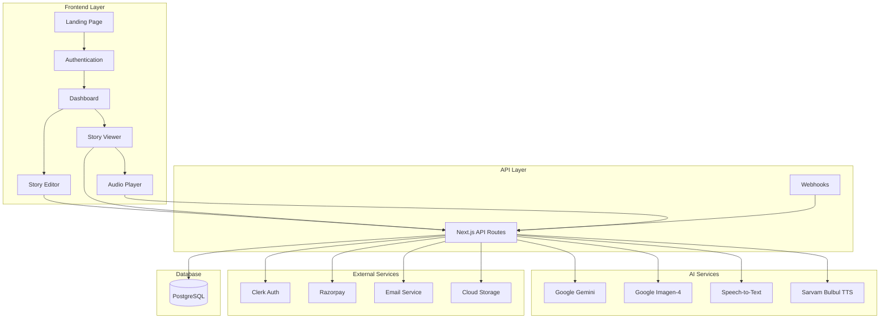

# Platform Redesign - Design Document

## Overview

This design document outlines the technical architecture and implementation approach for the comprehensive StoryWeave platform redesign. The platform will support therapeutic life stories and creative writing with advanced AI assistance, multi-language support, audio narration, and print-on-demand services.

## Architecture

### High-Level Architecture



## Components and Interfaces

### 1. Landing Page Component

**Purpose:** Attract and convert visitors into users

**Key Features:**
- Hero section with value proposition
- Feature showcase sections
- Strong CTAs throughout
- Responsive white-themed design
- Social proof (testimonials, stats)

**Component Structure:**
```typescript
// app/page.tsx
- HeroSection
  - Headline
  - Subheadline
  - Primary CTA
  - Hero Image/Animation
- FeaturesSection
  - WriteStoriesFeature
  - PublishOnlineFeature
  - CreateEbookFeature
  - PrintCopyFeature
- HowItWorksSection
  - Step1: Sign Up
  - Step2: Choose Story Type
  - Step3: Write with AI
  - Step4: Publish & Share
- TestimonialsSection
- PricingSection (for print copies)
- FinalCTASection
```


### 2. Enhanced Dashboard Component

**Purpose:** Central hub for story management and analytics

**Component Structure:**
```typescript
// app/dashboard/page.tsx
interface DashboardProps {
  stories: Story[];
  appointments: Appointment[];
  printOrders: PrintOrder[];
}

- DashboardHeader
  - WelcomeMessage
  - QuickStats (total stories, views, likes)
- TabNavigation
  - StoriesTab
    - StoryGrid
      - StoryCard (with action menu)
        - Edit
        - Delete
        - Publish/Unpublish
        - Talk to Expert
        - View Analytics
        - Order Print
  - ExpertSessionsTab
  - PrintOrdersTab
  - AnalyticsTab (aggregate)
- FloatingActionButton (+ New Story)
```

### 3. Story Creation Flow

**3.1 Story Type Selection**

```typescript
// app/create/page.tsx
- StoryTypeSelector
  - LifeStoryOption
    - Icon
    - Title: "Change Your Story, Change Your Life"
    - Description
    - CTA Button
  - CreativeStoryOption
    - Icon
    - Title: "Write Your Own Story"
    - Description
    - CTA Button
```

**3.2 Life Story Editor (7 Stages)**

```typescript
// app/life-story/[storyId]/page.tsx
interface LifeStage {
  id: string;
  name: string;
  nativeName: string;
  description: string;
  content: string;
  isCompleted: boolean;
}

const LIFE_STAGES = [
  { name: "Childhood", nativeName: "बचपन", icon: "🧒" },
  { name: "Teenage Years", nativeName: "किशोरावस्था", icon: "🎓" },
  { name: "Young Adult", nativeName: "युवावस्था", icon: "🎯" },
  { name: "Career & Growth", nativeName: "करियर और विकास", icon: "💼" },
  { name: "Marriage & Family", nativeName: "विवाह और परिवार", icon: "👨‍👩‍👧‍👦" },
  { name: "Maturity", nativeName: "परिपक्वता", icon: "🌟" },
  { name: "Wisdom Years", nativeName: "अनुभव के वर्ष", icon: "🧘" }
];

- StageNavigator (sidebar)
  - StageList (can jump to any stage)
- StageEditor
  - StageHeader
  - AIEditor
    - VoiceInputButton
    - TextArea
    - AIToolbar
      - Rewrite
      - Improve Grammar
      - Expand Content
      - Translate
  - ProgressIndicator
- SubmitButton
```

**3.3 Creative Story Editor**

```typescript
// app/creative-story/[storyId]/page.tsx
- StoryMetadata
  - TitleInput
  - AutoGeneratedDescription (read-only, updates on content change)
- AIEditor (same as life story)
  - VoiceInputButton
  - RichTextEditor
  - AIToolbar
- SubmitButton
```

### 4. Story Generation Configuration

```typescript
// components/story-generation-dialog.tsx
interface GenerationConfig {
  includeAIImages: boolean;
  numberOfPages: number;
  improveGrammar: boolean;
  tone: 'formal' | 'casual' | 'poetic' | 'narrative';
  targetAudience: 'children' | 'adults' | 'all';
  imageStyle: 'realistic' | 'artistic' | 'minimalist';
}

- GenerationDialog
  - AIImagesToggle
  - PageCountSelector (4, 8, 12, 16, 20, custom)
  - GrammarImprovementToggle
  - ToneSelector
  - AudienceSelector
  - ImageStyleSelector
  - EstimatedTimeDisplay
  - SubmitButton
```

### 5. Story Viewer with Audio

```typescript
// app/story/[storyId]/page.tsx
- StoryHeader
  - Title
  - Author
  - PublishedDate
  - Stats (views, likes, listens)
- ActionBar
  - ShareButton
  - LikeButton
  - ListenButton
  - OrderPrintButton
- StoryContent (markdown rendered)
  - Images (optimally placed)
  - Formatted text
- AudioPlayer (when listening)
  - ChapterNavigation
  - PlaybackControls
  - LanguageSelector
  - SpeedControl
  - ProgressBar
- CommentSection
  - CommentList
    - Comment
      - Author
      - Content
      - Timestamp
      - ReplyButton
      - Replies (nested)
  - CommentInput (if logged in)
```


## Data Models

### Enhanced Database Schema

```typescript
// Life Stage Template
export const lifeStageTemplates = pgTable("life_stage_templates", {
  id: uuid("id").primaryKey().defaultRandom(),
  userId: uuid("user_id").notNull().references(() => users.id),
  stageName: text("stage_name").notNull(), // "childhood", "teenage", etc.
  content: text("content"),
  language: text("language").default("en"),
  createdAt: timestamp("created_at").defaultNow(),
  updatedAt: timestamp("updated_at").defaultNow(),
});

// Story Stages (for life stories)
export const storyStages = pgTable("story_stages", {
  id: uuid("id").primaryKey().defaultRandom(),
  storyId: uuid("story_id").notNull().references(() => stories.id),
  stageIndex: integer("stage_index").notNull(),
  stageName: text("stage_name").notNull(),
  content: text("content"),
  audioUrl: text("audio_url"),
  createdAt: timestamp("created_at").defaultNow(),
  updatedAt: timestamp("updated_at").defaultNow(),
});

// Comments
export const comments = pgTable("comments", {
  id: uuid("id").primaryKey().defaultRandom(),
  storyId: uuid("story_id").notNull().references(() => stories.id),
  userId: uuid("user_id").notNull().references(() => users.id),
  parentCommentId: uuid("parent_comment_id").references(() => comments.id),
  content: text("content").notNull(),
  createdAt: timestamp("created_at").defaultNow(),
  updatedAt: timestamp("updated_at").defaultNow(),
});

// Likes
export const likes = pgTable("likes", {
  id: uuid("id").primaryKey().defaultRandom(),
  storyId: uuid("story_id").notNull().references(() => stories.id),
  userId: uuid("user_id").notNull().references(() => users.id),
  createdAt: timestamp("created_at").defaultNow(),
});

// Audio Chapters
export const audioChapters = pgTable("audio_chapters", {
  id: uuid("id").primaryKey().defaultRandom(),
  storyId: uuid("story_id").notNull().references(() => stories.id),
  chapterIndex: integer("chapter_index").notNull(),
  language: text("language").notNull(),
  audioUrl: text("audio_url").notNull(),
  duration: integer("duration"), // in seconds
  startPosition: integer("start_position"), // character position in story
  endPosition: integer("end_position"),
  createdAt: timestamp("created_at").defaultNow(),
});

// Print Orders
export const printOrders = pgTable("print_orders", {
  id: uuid("id").primaryKey().defaultRandom(),
  storyId: uuid("story_id").notNull().references(() => stories.id),
  userId: uuid("user_id").notNull().references(() => users.id),
  orderStatus: text("order_status").notNull().default("pending"), // pending, paid, processing, shipped, delivered
  bookSize: text("book_size").notNull(), // A5, A4, custom
  coverType: text("cover_type").notNull(), // hardcover, paperback
  quantity: integer("quantity").notNull().default(1),
  totalAmount: integer("total_amount").notNull(), // in paise
  razorpayOrderId: text("razorpay_order_id"),
  razorpayPaymentId: text("razorpay_payment_id"),
  shippingAddress: jsonb("shipping_address").notNull(),
  trackingNumber: text("tracking_number"),
  createdAt: timestamp("created_at").defaultNow(),
  updatedAt: timestamp("updated_at").defaultNow(),
});

// Generation Jobs (for background processing)
export const generationJobs = pgTable("generation_jobs", {
  id: uuid("id").primaryKey().defaultRandom(),
  storyId: uuid("story_id").notNull().references(() => stories.id),
  jobType: text("job_type").notNull(), // story_generation, image_generation, audio_generation
  status: text("status").notNull().default("pending"), // pending, processing, completed, failed
  config: jsonb("config"),
  result: jsonb("result"),
  error: text("error"),
  createdAt: timestamp("created_at").defaultNow(),
  updatedAt: timestamp("updated_at").defaultNow(),
});
```

## AI Integration

### 1. Google Gemini Integration

**Purpose:** Content generation, translation, grammar improvement

```typescript
// lib/ai/gemini-service.ts
export class GeminiService {
  async generateStoryFromStages(stages: LifeStage[], config: GenerationConfig): Promise<string>
  async improveGrammar(text: string, language: string): Promise<string>
  async rewriteContent(text: string, tone: string): Promise<string>
  async expandContent(text: string, context: string): Promise<string>
  async translateText(text: string, targetLanguage: string): Promise<string>
  async generateDescription(storyContent: string): Promise<string>
  async generateImagePrompts(storyContent: string, numberOfImages: number): Promise<string[]>
}
```

### 2. Google Imagen-4 Integration

**Purpose:** AI image generation for stories

```typescript
// lib/ai/imagen-service.ts
import { GoogleGenAI } from "@google/genai";

export class ImagenService {
  private ai: GoogleGenAI;
  
  constructor() {
    this.ai = new GoogleGenAI({});
  }
  
  async generateImages(prompts: string[], style: string): Promise<GeneratedImage[]> {
    const response = await this.ai.models.generateImages({
      model: 'imagen-4.0-generate-001',
      prompt: prompts[0],
      config: {
        numberOfImages: prompts.length,
        aspectRatio: '16:9',
        style: style,
      },
    });
    
    return response.generatedImages.map((img, idx) => ({
      imageBytes: img.image.imageBytes,
      prompt: prompts[idx],
      index: idx
    }));
  }
  
  async uploadToStorage(imageBytes: string, storyId: string, index: number): Promise<string>
}
```

### 3. Speech-to-Text Integration

**Purpose:** Voice input for story writing

```typescript
// lib/ai/stt-service.ts
export class STTService {
  async transcribe(audioBlob: Blob, language: string): Promise<string>
  async streamTranscribe(audioStream: MediaStream, language: string, onTranscript: (text: string) => void): Promise<void>
}

// Recommended STT providers for Indian languages:
// - Google Cloud Speech-to-Text (best accuracy for Indian languages)
// - Azure Speech Services (good alternative)
// - Sarvam AI (specialized for Indian languages)
```

### 4. Enhanced TTS Integration

**Purpose:** Convert stories to audio with chapter-based playback

```typescript
// lib/ai/tts-service.ts
export class TTSService {
  async generateAudioChapters(
    storyContent: string,
    language: string,
    chapterDuration: number = 60 // seconds
  ): Promise<AudioChapter[]> {
    // Split story into ~1 minute chunks
    const chunks = this.splitIntoChapters(storyContent, chapterDuration);
    
    const chapters: AudioChapter[] = [];
    for (let i = 0; i < chunks.length; i++) {
      const audioData = await sarvamTTS({
        text: chunks[i].text,
        language,
        speaker: "anushka",
      });
      
      const audioUrl = await this.uploadAudio(audioData, `chapter-${i}`);
      chapters.push({
        index: i,
        audioUrl,
        duration: chunks[i].estimatedDuration,
        startPosition: chunks[i].startPos,
        endPosition: chunks[i].endPos,
      });
    }
    
    return chapters;
  }
  
  private splitIntoChapters(text: string, targetDuration: number): TextChunk[]
}
```


## API Endpoints

### Story Management

```typescript
// Story Creation & Management
POST   /api/stories/life-story          - Create new life story
POST   /api/stories/creative-story      - Create new creative story
GET    /api/stories/[storyId]           - Get story details
PATCH  /api/stories/[storyId]           - Update story
DELETE /api/stories/[storyId]           - Delete story
POST   /api/stories/[storyId]/publish   - Publish story
POST   /api/stories/[storyId]/unpublish - Unpublish story

// Life Story Stages
GET    /api/stories/[storyId]/stages    - Get all stages
POST   /api/stories/[storyId]/stages    - Create/update stage
GET    /api/user/stage-templates        - Get user's saved stage templates
POST   /api/user/stage-templates        - Save stage template for reuse

// Story Generation
POST   /api/stories/[storyId]/generate  - Trigger story generation with config
GET    /api/stories/[storyId]/generation-status - Check generation progress
```

### AI Services

```typescript
// AI Assistance
POST   /api/ai/rewrite                  - Rewrite content
POST   /api/ai/grammar                  - Improve grammar
POST   /api/ai/expand                   - Expand content
POST   /api/ai/translate                - Translate text
POST   /api/ai/description              - Generate description

// Image Generation
POST   /api/ai/images/generate          - Generate images from prompts
POST   /api/ai/images/prompts           - Generate image prompts from story

// Voice Services
POST   /api/ai/stt                      - Speech to text
POST   /api/ai/tts/chapters             - Generate audio chapters
GET    /api/stories/[storyId]/audio     - Get audio chapters
```

### Social Features

```typescript
// Comments
GET    /api/stories/[storyId]/comments  - Get all comments
POST   /api/stories/[storyId]/comments  - Add comment
POST   /api/comments/[commentId]/reply  - Reply to comment
DELETE /api/comments/[commentId]        - Delete comment

// Likes
POST   /api/stories/[storyId]/like      - Like story
DELETE /api/stories/[storyId]/like      - Unlike story
GET    /api/stories/[storyId]/likes     - Get like count

// Sharing
GET    /api/stories/[storyId]/share-meta - Get Open Graph metadata
```

### Print Orders

```typescript
// Print on Demand
POST   /api/print-orders                - Create print order
GET    /api/print-orders                - Get user's print orders
GET    /api/print-orders/[orderId]      - Get order details
POST   /api/print-orders/[orderId]/payment - Process payment

// Razorpay Integration
POST   /api/payment/create-order        - Create Razorpay order
POST   /api/payment/verify              - Verify payment
POST   /api/webhooks/razorpay           - Razorpay webhook
```

## Background Job Processing

### Job Queue System

```typescript
// lib/jobs/queue.ts
export class JobQueue {
  async addJob(jobType: string, data: any): Promise<string>
  async processJob(jobId: string): Promise<void>
  async getJobStatus(jobId: string): Promise<JobStatus>
}

// Job Types
enum JobType {
  STORY_GENERATION = 'story_generation',
  IMAGE_GENERATION = 'image_generation',
  AUDIO_GENERATION = 'audio_generation',
  PRINT_ORDER_PROCESSING = 'print_order_processing',
}

// Job Processors
class StoryGenerationProcessor {
  async process(storyId: string, config: GenerationConfig): Promise<void> {
    // 1. Fetch story stages/content
    // 2. Generate complete story using Gemini
    // 3. If images enabled, generate image prompts
    // 4. Generate images using Imagen-4
    // 5. Format story in markdown with images
    // 6. Save formatted story
    // 7. Update job status
  }
}

class AudioGenerationProcessor {
  async process(storyId: string, language: string): Promise<void> {
    // 1. Fetch story content
    // 2. Split into 1-minute chapters
    // 3. Generate audio for each chapter using Sarvam Bulbul
    // 4. Upload audio files to storage
    // 5. Save chapter metadata to database
    // 6. Update job status
  }
}
```

## Error Handling

### Error Types and Recovery

```typescript
// lib/errors/story-errors.ts
export class StoryGenerationError extends Error {
  constructor(message: string, public retryable: boolean = true) {
    super(message);
  }
}

export class ImageGenerationError extends Error {
  constructor(message: string, public failedPrompts: string[]) {
    super(message);
  }
}

export class AudioGenerationError extends Error {
  constructor(message: string, public failedChapters: number[]) {
    super(message);
  }
}

// Error Recovery Strategies
export const errorRecovery = {
  storyGeneration: async (error: StoryGenerationError, storyId: string) => {
    if (error.retryable) {
      // Retry with simplified prompt
      // Or use fallback model
    } else {
      // Notify user and save draft
    }
  },
  
  imageGeneration: async (error: ImageGenerationError, storyId: string) => {
    // Use placeholder images for failed prompts
    // Or retry with modified prompts
  },
  
  audioGeneration: async (error: AudioGenerationError, storyId: string) => {
    // Regenerate only failed chapters
    // Or provide text-only fallback
  }
};
```

## Testing Strategy

### Unit Tests

```typescript
// Test AI Services
describe('GeminiService', () => {
  test('should generate story from stages')
  test('should improve grammar')
  test('should translate text')
  test('should handle API errors gracefully')
});

describe('ImagenService', () => {
  test('should generate images from prompts')
  test('should handle rate limits')
  test('should retry on failure')
});

describe('TTSService', () => {
  test('should split story into chapters')
  test('should generate audio for each chapter')
  test('should handle long stories')
});
```

### Integration Tests

```typescript
// Test Complete Workflows
describe('Story Creation Flow', () => {
  test('should create life story with stages')
  test('should save stage templates for reuse')
  test('should generate complete story with images')
  test('should publish story successfully')
});

describe('Audio Generation Flow', () => {
  test('should generate audio chapters')
  test('should support multiple languages')
  test('should handle playback state')
});

describe('Print Order Flow', () => {
  test('should create print order')
  test('should process payment')
  test('should update order status')
});
```

### E2E Tests

```typescript
// Test User Journeys
describe('New User Journey', () => {
  test('should sign up and create first story')
  test('should use voice input')
  test('should generate and publish story')
});

describe('Returning User Journey', () => {
  test('should see pre-filled stage templates')
  test('should view analytics')
  test('should order print copy')
});
```


## Performance Optimization

### Caching Strategy

```typescript
// Cache Layers
1. Browser Cache
   - Static assets (images, fonts)
   - Audio chapters (IndexedDB)
   - Story content (localStorage for drafts)

2. CDN Cache
   - Published stories
   - Generated images
   - Audio files

3. Server Cache (Redis)
   - User sessions
   - Story metadata
   - Analytics data
   - AI responses (for common requests)

4. Database Query Cache
   - Popular stories
   - User profiles
   - Comment threads
```

### Image Optimization

```typescript
// lib/image-optimization.ts
export class ImageOptimizer {
  async optimizeForWeb(imageBytes: string): Promise<OptimizedImage> {
    // Resize to appropriate dimensions
    // Compress with quality settings
    // Generate multiple sizes (thumbnail, medium, large)
    // Convert to WebP format
    // Generate blur placeholder
  }
  
  async optimizeForPrint(imageBytes: string): Promise<PrintImage> {
    // Maintain high resolution (300 DPI)
    // Convert to CMYK color space
    // Ensure proper dimensions for print size
  }
}
```

### Audio Streaming

```typescript
// lib/audio-streaming.ts
export class AudioStreamer {
  async streamChapter(chapterUrl: string): Promise<ReadableStream> {
    // Stream audio in chunks
    // Support range requests
    // Implement adaptive bitrate
  }
  
  async preloadNextChapter(nextChapterUrl: string): Promise<void> {
    // Preload next chapter in background
    // Store in IndexedDB for offline access
  }
}
```

## Security Considerations

### Content Security

```typescript
// Content Moderation
export class ContentModerator {
  async checkContent(text: string): Promise<ModerationResult> {
    // Check for inappropriate content
    // Flag for manual review if needed
    // Block spam and malicious content
  }
}

// Rate Limiting
export const rateLimits = {
  storyCreation: '10 per hour',
  aiRequests: '100 per hour',
  imageGeneration: '20 per day',
  audioGeneration: '10 per day',
  comments: '30 per hour',
};
```

### Payment Security

```typescript
// Razorpay Integration Security
export class PaymentSecurity {
  verifySignature(orderId: string, paymentId: string, signature: string): boolean
  encryptSensitiveData(data: any): string
  validateAmount(amount: number): boolean
  preventDoublePayment(orderId: string): Promise<boolean>
}
```

## Deployment Strategy

### Environment Configuration

```typescript
// .env.production
NEXT_PUBLIC_APP_URL=https://storyweave.app
DATABASE_URL=postgresql://...
CLERK_SECRET_KEY=...
GEMINI_API_KEY=...
IMAGEN_API_KEY=...
SARVAM_API_KEY=...
RAZORPAY_KEY_ID=...
RAZORPAY_KEY_SECRET=...
REDIS_URL=...
STORAGE_BUCKET=...
EMAIL_SERVICE_KEY=...
```

### Deployment Pipeline

```yaml
# .github/workflows/deploy.yml
name: Deploy to Production

on:
  push:
    branches: [main]

jobs:
  deploy:
    runs-on: ubuntu-latest
    steps:
      - Checkout code
      - Run tests
      - Build application
      - Run database migrations
      - Deploy to Vercel
      - Invalidate CDN cache
      - Run smoke tests
      - Notify team
```

### Monitoring and Logging

```typescript
// lib/monitoring.ts
export class Monitor {
  trackError(error: Error, context: any): void
  trackPerformance(metric: string, value: number): void
  trackUserAction(action: string, userId: string): void
  trackAIUsage(service: string, tokens: number): void
}

// Key Metrics to Monitor
- Story generation success rate
- Image generation success rate
- Audio generation success rate
- API response times
- Error rates by endpoint
- User engagement metrics
- Payment success rate
- Print order fulfillment time
```

## Accessibility

### WCAG 2.1 AA Compliance

```typescript
// Accessibility Features
1. Keyboard Navigation
   - All interactive elements accessible via keyboard
   - Logical tab order
   - Skip navigation links

2. Screen Reader Support
   - Semantic HTML
   - ARIA labels and roles
   - Alt text for images
   - Transcripts for audio

3. Visual Accessibility
   - High contrast mode
   - Adjustable font sizes
   - Color-blind friendly palette
   - Focus indicators

4. Audio Accessibility
   - Captions for audio content
   - Visual indicators for audio playback
   - Adjustable playback speed

5. Language Support
   - Multi-language interface
   - RTL support for applicable languages
   - Language-specific fonts
```

## Mobile Optimization

### Progressive Web App (PWA)

```typescript
// next.config.js
const withPWA = require('next-pwa')({
  dest: 'public',
  register: true,
  skipWaiting: true,
});

module.exports = withPWA({
  // Next.js config
});

// Features
- Offline story reading
- Cached audio chapters
- Add to home screen
- Push notifications for comments/likes
- Background audio playback
```

### Responsive Design

```typescript
// Breakpoints
const breakpoints = {
  mobile: '320px - 767px',
  tablet: '768px - 1023px',
  desktop: '1024px+',
};

// Mobile-First Approach
- Touch-friendly UI elements
- Optimized images for mobile
- Reduced data usage
- Simplified navigation
- Bottom navigation bar
```

## Internationalization (i18n)

### Language Support

```typescript
// lib/i18n/config.ts
export const supportedLanguages = [
  { code: 'en', name: 'English', nativeName: 'English' },
  { code: 'hi', name: 'Hindi', nativeName: 'हिंदी' },
  { code: 'bn', name: 'Bengali', nativeName: 'বাংলা' },
  { code: 'ta', name: 'Tamil', nativeName: 'தமிழ்' },
  { code: 'te', name: 'Telugu', nativeName: 'తెలుగు' },
  { code: 'mr', name: 'Marathi', nativeName: 'मराठी' },
  { code: 'gu', name: 'Gujarati', nativeName: 'ગુજરાતી' },
  { code: 'kn', name: 'Kannada', nativeName: 'ಕನ್ನಡ' },
  { code: 'ml', name: 'Malayalam', nativeName: 'മലയാളം' },
  { code: 'pa', name: 'Punjabi', nativeName: 'ਪੰਜਾਬੀ' },
  { code: 'or', name: 'Odia', nativeName: 'ଓଡ଼ିଆ' },
];

// Translation Files
// locales/en/common.json
// locales/hi/common.json
// etc.
```

## Analytics and Insights

### User Analytics

```typescript
// Track User Behavior
- Story creation funnel
- Feature usage
- Time spent on platform
- Engagement metrics
- Conversion rates

// Story Analytics
- Views per story
- Listen rate
- Completion rate
- Share rate
- Comment engagement
- Like/reaction distribution

// Business Metrics
- User acquisition cost
- Lifetime value
- Print order conversion rate
- Revenue per user
- Churn rate
```

This comprehensive design provides a solid foundation for implementing the platform redesign with all the requested features including AI assistance, multi-language support, audio narration, and print-on-demand services.
