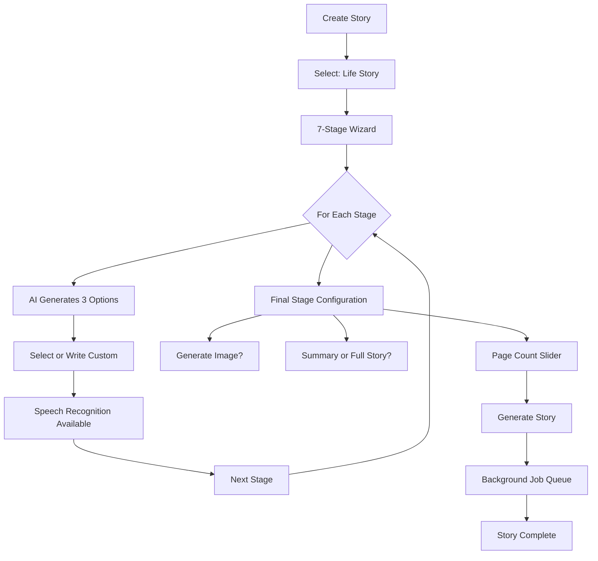
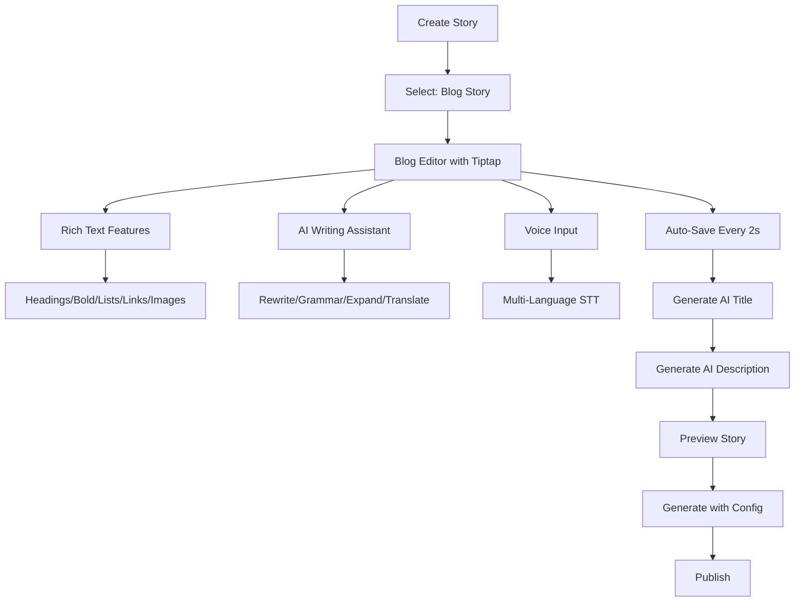
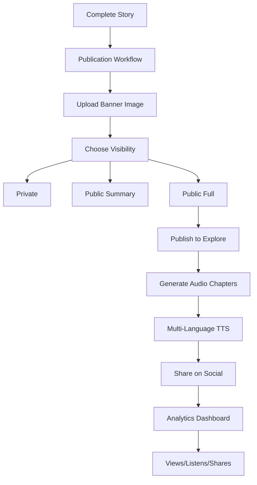
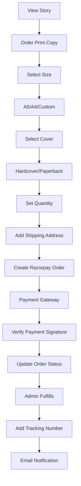
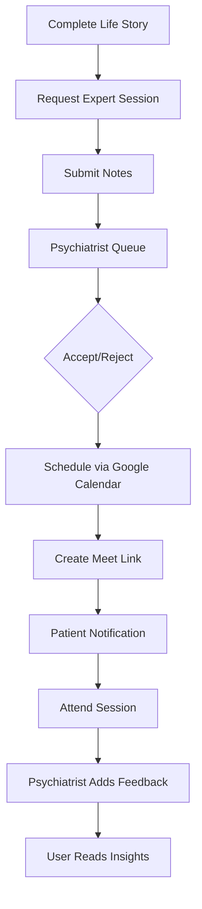

# StoryWeave - AI-Powered Narrative Platform

**Transform Your Life Through Storytelling**

A comprehensive full-stack platform for creating, editing, and publishing life stories and creative blogs with AI assistance, multi-language audio narration, print-on-demand services, and professional psychiatric support.

---

## 🎯 Overview

StoryWeave is a therapeutic and creative storytelling platform that helps users document their life journeys or create engaging blog stories. The platform combines cutting-edge AI technology with human expertise to provide a unique storytelling experience.

### Key Value Propositions
- **Life Story Documentation**: 7-stage guided wizard for capturing complete life narratives
- **Creative Blog Writing**: Rich text editor with AI-powered writing assistance
- **Multi-Language Support**: Text-to-speech in 10+ Indian languages (Sarvam AI)
- **Print on Demand**: Professional book printing and delivery via Razorpay
- **Expert Support**: Schedule sessions with psychiatrists for therapeutic storytelling
- **Community Features**: Public discovery, likes, comments, and sharing
- **Background Processing**: Robust job queue for AI generations that don't block the UI

---

## 🏗️ Architecture

### Application Structure

```
/app
├── page.tsx                          # Landing page with marketing sections
├── create/page.tsx                   # Story type selection (Life or Blog)
├── wizard/[storyId]/page.tsx         # 7-stage life story wizard
├── life-story/[storyId]/page.tsx     # Life story stage-by-stage editor
├── blog-editor/[storyId]/page.tsx    # Rich text blog editor with AI tools
├── story/[storyId]/page.tsx          # Story viewer (auto-generates on load)
├── dashboard/page.tsx                # User dashboard with tabs (stories/liked/appointments/print orders/analytics)
├── explore/page.tsx                  # Discover public stories
├── publish/[storyId]/page.tsx        # Publication workflow
├── orders/page.tsx                   # Print order history
├── admin/                            # Admin panel
│   ├── page.tsx                      # User/story/order/job management
│   ├── jobs/page.tsx                 # Background job monitoring
│   ├── moderation/page.tsx           # Content moderation
│   └── print-orders/page.tsx         # Fulfill print orders
├── psychiatrist/                     # Psychiatrist portal
│   ├── page.tsx                      # Appointment queue
│   └── story/[storyId]/page.tsx      # Review stories with notes
└── api/                              # Backend API routes
```

### Database Schema

**Core Tables:**
- **users**: Clerk authentication with roles (user/psychiatrist/admin)
- **stories**: Main content table (life_story/blog_story types)
- **storyStages**: Life story stage content (7 stages)
- **lifeStageTemplates**: User-saved templates for reuse
- **summaries**: AI-generated insights and actionable steps
- **images**: Story banner images
- **audioChapters**: Chunked audio for TTS (multi-language)
- **comments**: Nested comment threads
- **likes**: User engagement tracking
- **printOrders**: Razorpay print-on-demand orders
- **appointments**: Psychiatrist consultations
- **generationJobs**: Background job tracking
- **contentFlags**: Content moderation system
- **storyAnalytics**: View/listen/share events

---

## 🎨 User Flows

### 1. Life Story Creation



**7 Life Stages:**
1. **Early Childhood (0-6)** - Warm family moments, first friends
2. **School Years (7-12)** - Learning adventures, favorite teachers
3. **Adolescence (13-19)** - Identity search, first heartbreak
4. **Young Adulthood (20-30)** - Career beginnings, moving out
5. **Career & Family (31-50)** - Parenthood, milestones
6. **Midlife Transition (51-65)** - Reflection, reinvention
7. **Later Life & Legacy (65+)** - Wisdom sharing, gratitude

### 2. Creative Blog Writing



**AI Assist Features:**
- **Rewrite**: Improve writing style and flow
- **Grammar**: Fix errors and enhance clarity
- **Expand**: Add more details and depth
- **Translate**: Convert to target language
- **Suggest**: Get continuation ideas
- **Title Generation**: From content or improve existing
- **Description Generation**: SEO-optimized summaries

### 3. Publication & Sharing



### 4. Print on Demand



### 5. Psychiatrist Sessions



---

## 🔧 Technical Features

### Frontend Architecture

**Framework**: Next.js 15 (App Router, Server Components, Server Actions)
**Rendering**:
- **SSR**: Story pages, user dashboards
- **CSR**: Editors, real-time features
- **ISR**: Public story discovery

**State Management**:
- **TanStack Query**: Server state caching
- **React Hook Form**: Form validation
- **Zustand** (if needed): Client state

**Styling**:
- **Tailwind CSS 4**: Utility-first styling
- **shadcn/ui**: Pre-built accessible components
- **Framer Motion**: Smooth animations
- **Geist Font**: Modern typography

### Backend Architecture

**API Layer**:
- **Next.js Route Handlers**: RESTful endpoints
- **Clerk Middleware**: Authentication & RBAC
- **Zod**: Runtime validation
- **CORS**: Configured for webhooks

**Database Layer**:
- **PostgreSQL**: Primary data store (Neon serverless)
- **Drizzle ORM**: Type-safe queries
- **Connection Pooling**: `@neondatabase/serverless`
- **Migrations**: Version-controlled schema changes

**Caching Layer**:
- **Redis**: Session storage, rate limiting
- **BullMQ**: Job queue persistence
- **Application Cache**: In-memory for hot paths

**Job Queue System**:
```typescript
// Job Types
- story_generation: AI-powered narrative creation
- image_generation: Banner/thumbnail creation
- audio_generation: TTS chapter generation

// Retry Strategy
- Exponential backoff (2s, 4s, 8s)
- Max attempts: 3-4 based on job type
- Dead letter queue for failed jobs

// Scaling
- Horizontal: Multiple worker processes
- Priority: User-facing jobs first
- Monitoring: Admin job dashboard
```

### AI Integration

**Google Gemini 2.0 Flash**:
- Story generation from wizard selections
- Writing assistance (rewrite, grammar, expand)
- Title and description generation
- Translation to multiple languages
- Suggestion generation
- Language quality checking

**Sarvam AI (Bulbul TTS)**:
- 10+ Indian language support
- Intelligent text chunking (sentence-aware)
- Audio chapter generation
- Streaming for long content
- Rate limiting with retry logic

**Google Cloud Vision** (if configured):
- Image generation via Imagen
- Banner optimization

### Security

**Authentication**:
- Clerk for user management
- Webhook signature verification
- Session-based authorization

**Authorization**:
- Role-based access control (RBAC)
- Story ownership validation
- Admin/Psychiatrist middleware

**Data Protection**:
- Input sanitization (Zod schemas)
- SQL injection prevention (Drizzle ORM)
- XSS protection (React escaping)
- CSRF tokens for forms

**Payment Security**:
- Razorpay signature verification
- Webhook secret validation
- Idempotent order creation
- Secure environment variables

**Content Moderation**:
- Automated flagging system
- Manual review workflow
- Spam detection
- User reporting

### Performance Optimization

**Image Optimization**:
```typescript
// Cloudinary transformations
- Responsive srcsets (400w, 800w, 1200w, 1600w)
- WebP/AVIF format auto-selection
- Lazy loading with blur placeholders
- Print quality (300 DPI for books)
- Thumbnail caching
```

**Audio Optimization**:
```typescript
// Intelligent chunking
- Sentence boundary detection
- 60-second chapter targets
- Sequential playback queueing
- Cloudinary CDN delivery
```

**Code Splitting**:
- Route-based chunks (automatic)
- Dynamic imports for heavy components
- Tree shaking for unused code

**Database Optimization**:
- Indexed foreign keys
- Composite indexes for queries
- Query result pagination
- Connection pooling

---

## 🚀 Getting Started

### Prerequisites

- **Node.js** 18.x or higher
- **PostgreSQL** 14+ (or Neon account)
- **Redis** 6+ (or Upstash account)
- **pnpm/npm** (pnpm recommended)

### Required API Keys

Create accounts and obtain API keys for:
1. **Clerk** - Authentication ([clerk.com](https://clerk.com))
2. **Neon** - PostgreSQL database ([neon.tech](https://neon.tech))
3. **Upstash Redis** - Job queue ([upstash.com](https://upstash.com))
4. **Google AI** - Gemini API ([ai.google.dev](https://ai.google.dev))
5. **Sarvam AI** - TTS ([sarvam.ai](https://sarvam.ai))
6. **Cloudinary** - Media storage ([cloudinary.com](https://cloudinary.com))
7. **Razorpay** - Payments ([razorpay.com](https://razorpay.com))

### Installation

1. **Clone the repository**:
   ```bash
   git clone <repository-url>
   cd story-writing
   ```

2. **Install dependencies**:
   ```bash
   npm install
   ```

3. **Configure environment variables**:
   ```bash
   cp .env.example .env
   ```

   Edit `.env` and add your keys:
   ```env
   # Database
   DATABASE_URL="postgresql://..."

   # Authentication
   NEXT_PUBLIC_CLERK_PUBLISHABLE_KEY="pk_test_..."
   CLERK_SECRET_KEY="sk_test_..."
   CLERK_WEBHOOK_SECRET="whsec_..."

   # AI Services
   GOOGLE_GENERATIVE_AI_API_KEY="AIza..."
   SARVAM_API_KEY="..."

   # Storage
   CLOUDINARY_CLOUD_NAME="..."
   CLOUDINARY_API_KEY="..."
   CLOUDINARY_API_SECRET="..."

   # Queue
   REDIS_URL="redis://..."

   # Payments
   RAZORPAY_KEY_ID="rzp_test_..."
   RAZORPAY_KEY_SECRET="..."
   RAZORPAY_WEBHOOK_SECRET="..."

   # App
   NEXT_PUBLIC_APP_URL="http://localhost:3000"
   ```

4. **Initialize database**:
   ```bash
   npm run db:push
   ```

5. **Start development server**:
   ```bash
   npm run dev
   ```

6. **Start background workers** (in a new terminal):
   ```bash
   npm run workers
   ```

7. **Open the app**:
   ```
   http://localhost:3000
   ```

### First-Time Setup

1. Visit `/sign-up` to create your account
2. Complete the onboarding flow
3. Create your first story from `/create`
4. Explore the wizard or blog editor

---

## 📜 Available Scripts

| Script | Description |
|--------|-------------|
| `npm run dev` | Start Next.js dev server with Turbopack |
| `npm run build` | Production build |
| `npm run start` | Start production server |
| `npm run lint` | Run ESLint |
| `npm run db:generate` | Generate Drizzle migrations |
| `npm run db:migrate` | Apply migrations |
| `npm run db:push` | Push schema to database (dev) |
| `npm run db:studio` | Open Drizzle Studio |
| `npm run workers` | Start BullMQ worker process |
| `npm run db:verify` | Verify schema integrity |

---

## 🎛️ Admin Features

Access `/admin` with admin role to:

- **User Management**: View all users, assign roles
- **Story Moderation**: Review flagged content
- **Print Orders**: Fulfill orders, add tracking
- **Job Monitoring**: View queue stats, retry failures
- **Content Flags**: Review reports, take action
- **Analytics**: Platform-wide metrics

---

## 🧠 Psychiatrist Portal

Access `/psychiatrist` with psychiatrist role to:

- **Appointment Queue**: See pending session requests
- **Story Review**: Read life stories with clinical notes
- **Schedule Sessions**: Create Google Meet links
- **Provide Feedback**: Add therapeutic insights
- **Track Confirmed**: Manage upcoming appointments

---

## 📱 Key Pages

| Route | Purpose |
|-------|---------|
| `/` | Landing page with hero, features, pricing |
| `/create` | Choose life story or blog story |
| `/wizard/[id]` | 7-stage life story wizard |
| `/life-story/[id]` | Stage-by-stage life editor |
| `/blog-editor/[id]` | Rich text blog editor |
| `/story/[id]` | View published story |
| `/dashboard` | User stories, appointments, orders, analytics |
| `/explore` | Discover public stories |
| `/publish/[id]` | Publication workflow |
| `/analytics/[id]` | Story-specific metrics |
| `/orders` | Print order history |
| `/admin` | Admin dashboard |
| `/psychiatrist` | Psychiatrist portal |

---

## 🔌 API Routes

### Stories
- `GET /api/stories` - List user stories
- `GET /api/stories/[id]` - Get story details
- `PATCH /api/stories/[id]` - Update story
- `DELETE /api/stories/[id]` - Delete story
- `GET /api/stories/[id]/content` - Get story content
- `PATCH /api/stories/[id]/content` - Update content
- `GET /api/stories/[id]/stages` - Get life story stages
- `POST /api/stories/[id]/stages` - Save stage content

### AI
- `POST /api/ai/generate` - Generate story from wizard
- `POST /api/ai/creative-story-assist` - Writing assistance
- `POST /api/ai/blog-generate` - Generate blog post
- `POST /api/ai/outline` - Create story outline
- `POST /api/ai/image-prompt` - Generate image prompt

### Audio
- `POST /api/tts/stream` - Stream TTS audio
- `POST /api/translate-tts` - Translate and speak
- `GET /api/audio/stream/[chapterId]` - Stream audio chapter

### Payments
- `POST /api/payment/create-order` - Create Razorpay order
- `POST /api/payment/verify` - Verify payment signature
- `GET /api/print-orders` - List print orders
- `POST /api/print-orders` - Create print order

### Admin
- `GET /api/admin/users` - List all users
- `PATCH /api/admin/users/[id]/role` - Change user role
- `GET /api/admin/jobs/list` - List background jobs
- `GET /api/admin/jobs/stats` - Job queue statistics
- `GET /api/admin/moderation` - List content flags
- `POST /api/admin/moderation/[id]` - Resolve flag

### Appointments
- `POST /api/appointments` - Request appointment
- `GET /api/appointments/user` - User's appointments
- `POST /api/psychiatrist/appointments/[id]/accept` - Accept appointment
- `POST /api/psychiatrist/appointments/[id]/schedule` - Schedule session
- `POST /api/psychiatrist/appointments/[id]/feedback` - Add feedback

---

## 🌍 Deployment

### Vercel Deployment

1. **Main App**:
   ```bash
   vercel
   ```
   - Auto-deploys from `main` branch
   - Environment variables in Vercel dashboard
   - Serverless functions for API routes

2. **Background Workers**:
   - Deploy as a separate long-running service (Railway/Render)
   - Set `REDIS_URL` and `DATABASE_URL`
   - Run `npm run workers`
   - Optional: Use Vercel Cron + Queue for lightweight jobs

### Environment Setup

Ensure these are configured in production:
- `DATABASE_URL` (Neon connection string)
- `REDIS_URL` (Upstash Redis URL)
- All API keys from `.env`
- `NEXT_PUBLIC_APP_URL` (your domain)

### Database Migrations

Run migrations on deploy:
```bash
npm run db:migrate
```

---

## 🧪 Testing

```bash
# Run all tests
npm test

# Run specific test file
npm test -- story.test.ts

# Watch mode
npm test -- --watch
```

**Test Coverage**:
- Unit tests for utilities
- Integration tests for API routes
- Component tests for critical UX

---

## 📄 License

This project is proprietary. All rights reserved.

---

## 🤝 Contributing

This is a private project. For access requests, contact the maintainer.

---

## 📞 Support

For issues or questions:
- Email: support@storyweave.com
- GitHub Issues: (if public)

---

## 🙏 Acknowledgments

- **Clerk** for authentication
- **Neon** for serverless Postgres
- **Vercel** for hosting
- **shadcn/ui** for component library
- **Google Gemini** for AI capabilities
- **Sarvam AI** for Indian language TTS
